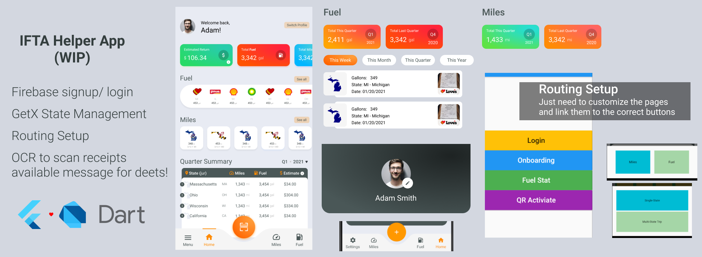

# IFTA-Helper-App

## What is this? 
A work-in-progress app to help you record your IFTA information and make filing easier. 

A work-in-progress project I worked on without any prior knowledge in modern mobile dev, Flutter, or Dart lang. The app's goal is to help truckers have an easier time keeping their IFTA-related information. At the moment, truckers have to save their receipts and miles in separate places. This app solves that issue and more. 

## Features
- Firebase signup/ sign-in setup
    -  You just need to add your own google-services file
- Statement management done with GetX
- Routing already setup, also using GetX
- Some UI components are done 
    - Custom table and custom nav bar 
- Code for the OCR to scan receipts is available (private repo) but will only send it to those genuinely interested/ recruiters. 
- Code for an image->clean PDF is also available but same as above

**NOTE: The OCR is the main part of the app and the project was meant for *someone... until things changed*, so I'm keeping that part private. If you're a recruiter or someone interested let me know.**

## Things to Know
- The package name is "alpha_build," `com.example.alpha_build` in case you encounter problems and not able to spot it
- For the GPS tracking, Google Directions API will not be as accurate to count miles across state borders. There's a specific company that is by far more accurate and argubly has the cleanest solution for this but they have some of the most horrible docs I've ever seen :( 

## Overall
- Flutter and Dart are an absolute joy to work with, even if you are not into mobile dev. 
- PS. be nice to people :)